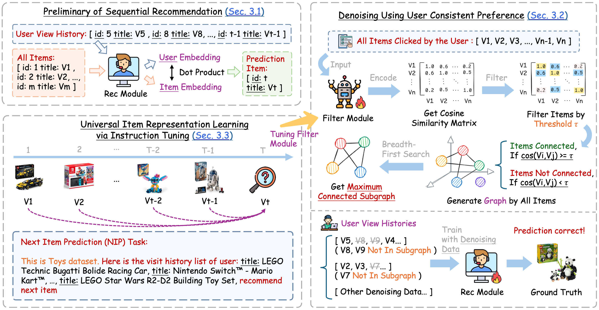
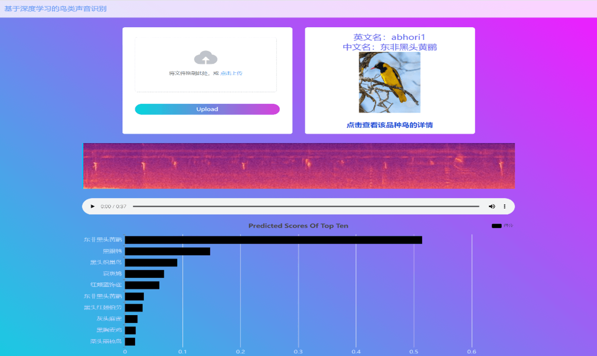

我目前在[东北大学](https://neu.edu.cn/)攻读计算机科学硕士学位，研究方向为信息检索和大语言模型。

我的研究兴趣涵盖自然语言处理（NLP）、信息检索、大语言模型（LLM）、检索增强生成（RAG）、推荐系统（Recsys）以及多模态领域。目前，我的工作包括多智能体、检索增强生成系统优化以及大语言模型的指令微调。

我拥有哈尔滨工程大学计算机科学与技术学士学位，本科期间由助理研究员[李超](https://mohub.net/help/MoHub/UserServiceCases/Cases1.html#%E6%95%99%E5%B8%88%E4%BB%8B%E7%BB%8D)指导。我还在[东北大学信息检索实验室](https://neuir.github.io/)进行研究实习，由[刘正皓](https://edwardzh.github.io/)副教授指导，同时也在[启元实验室](https://qiyuanzp.zhiye.com/)、[面壁智能](https://www.openbmb.cn/)和[清华大学自然语言处理与社会人文计算实验室](https://nlp.csai.tsinghua.edu.cn/)实习，由[闫宇坤](https://scholar.google.com/citations?hl=en&user=B88nSvIAAAAJ&view_op=list_works)老师指导。 

---

<!--  -->
总页面浏览量:  \| 上次编辑时间: 2025-08-23 \| 联系方式: [*hdxin2002@gmail.com*](mailto://hdxin2002@gmail.com)

---

# 🔥 新闻

- *2025.08*: &nbsp;🎉 我们的论文TASTE$^+$被WISA 2025录用!
- *2025.08*: &nbsp;🎉 我们的论文LLMsPark被EMNLP 2025 (CCF-B类会议)录用!
- *2024.04*：&nbsp;🎉 我们发布了一个GitHub代码库 [heu-icicles](https://github.com/HEUOpenResource/heu-icicles) ，欢迎提出问题和提交拉取请求！
- *2024.02*：&nbsp;🎉 我们的论文MMAD被LREC-COLING 2024（CCF-B类会议）录用！
- *2023.05*：&nbsp;🎉 我们在2023年数学建模竞赛（MCM/ICM）上提出了一个用于预测Wordle游戏结果的模型！

# 📝 发表成果 

> \* 表示同等贡献，† 表示通讯作者。

arXiv 2025

# ConsRec: Denoising Sequential Recommendation through User-Consistent Preference Modeling

**Haidong Xin**$^{\*}$, [Qiushi Xiong$^{\*}$](https://scholar.google.com/citations?user=dFXhQlsAAAAJ), [Zhenghao Liu$^†$](https://scholar.google.com/citations?user=4vrZRk0AAAAJ), [Sen Mei](https://scholar.google.com/citations?user=JWqmlrcAAAAJ), [Yukun Yan](https://scholar.google.com/citations?user=B88nSvIAAAAJ), [Shi Yu](https://scholar.google.com/citations?user=xcMVPTgAAAAJ), [Shuo Wang](https://scholar.google.com/citations?user=5vm5yAMAAAAJ), [Yu Gu](https://scholar.google.com/citations?user=IDYbTZwAAAAJ), [Ge Yu](https://scholar.google.com/citations?user=HClMOmUAAAAJ), [Chenyan Xiong](https://scholar.google.com/citations?user=E9BaEBYAAAAJ)

[**📃Paper**](https://arxiv.org/abs/2505.22130) \| [**📄PDF**](https://arxiv.org/pdf/2505.22130) \| 

- 这项工作实现了通过一致性用户偏好建模对用户交互序列去噪，从而提升序列推荐系统的性能。

LREC-COLING 2024

# MMAD: Multi-modal Movie Audio Description

[Xiaojun Ye](https://scholar.google.com/citations?user=BKMYsm4AAAAJ&hl=en), [Junhao Chen](https://scholar.google.com/citations?hl=en&user=uVMnzPMAAAAJ), [Xiang Li](https://scholar.google.com/citations?user=_wyYvQsAAAAJ&hl=en), **Haidong Xin**, Chao Li, [Sheng Zhou$^†$](https://scholar.google.com/citations?user=Ss76nMwAAAAJ&hl=en), [Jiajun Bu](https://scholar.google.com/citations?user=OgZP2okAAAAJ&hl=en)

[**📃论文**](https://aclanthology.org/2024.lrec-main.998/) \| [**📄PDF**](https://aclanthology.org/2024.lrec-main.998.pdf) \| [**🗂️项目网站**](https://daria8976.github.io/mmad-page/) \| 

- 这项工作为视障人士开启了全新的观影体验。

arXiv 2023

# Puzzle game: Prediction and Classification of Wordle Solution Words

**Haidong Xin**$^{\*†}$, [Fang Wu$^{\*}$](https://wfloveiu.github.io/), [Zhitong Zhou$^{\*}$](https://scholar.google.com/citations?user=aG3jVDUAAAAJ&hl=en)

[**📃论文**](https://arxiv.org/abs/2403.19433) \| [**📄PDF**](https://arxiv.org/pdf/2403.19433) \| 

- 这项工作对 Wordle 游戏进行了详细的数值分析，揭示了其中的统计规律。

# 🏆 获奖情况

- *2024.11* 🥇校优秀学生一等奖学金。
- *2023.07* 🥈中国大学生计算机设计大赛国家二等奖。
- *2023.05* 🥈美国大学生数学建模竞赛荣誉提名奖。
- *2023.05* 🥈中国大学生创新创业大赛二等奖。
- *2022.11* 🥇中国大学生数学建模竞赛一等奖。
- *2022.10* 🥈东北三省数学建模联赛二等奖。
- *2022.05* 🥇校优秀学生一等奖学金。
- *2021.05* 🥇校优秀学生一等奖学金。

# 🔨 项目经历

语料库智能检索系统

# Corpus Intelligent Retrieval System

**辛海东**, [吴方](https://wfloveiu.github.io/), [叶笑君](https://scholar.google.com/citations?user=BKMYsm4AAAAJ&hl=en), 张先煜, 孙靖博

[**🔨项目**](https://github.com/xhd0728/Corpus_Intelligent_Retrieval_System) \|  \| [**http://corpus.hrbeu.edu.cn**](http://corpus.hrbeu.edu.cn)

- 本项目是一个采用前后端方式实现的语料库智能检索系统。我们实现了语料库的数据管理和权限管理。

Bird Sound Classification

# 鸟类声音分类系统

[李响](https://scholar.google.com/citations?user=_wyYvQsAAAAJ&hl=en), [吴方](https://wfloveiu.github.io/), **辛海东**

[**🔨项目**](https://github.com/xhd0728/Bird_Sound_Classification) \| 

- 本项目是中国大学生计算机设计大赛的获奖作品。我们构建了一个前后端系统，用于展示鸟类音频分类结果和百科信息。

Ray Tracing With OpenGL

# 使用 OpenGL 进行光线追踪

**辛海东**, 张先煜, 岳观澜

[**🔨项目**](https://github.com/xhd0728/Ray_Tracing_With_OpenGL) \| 

- 本项目是中国大学生计算机设计大赛的获奖作品。我们使用 OpenGL 库和 NVIDIA 驱动实现了光线追踪。

# 📖 教育背景

- *2024.09 - now*, M.S. [计算机科学与工程学院](http://www.cse.neu.edu.cn/), [东北大学](https://neu.edu.cn/)
- *2020.09 - 2024.07*, B.S. [计算机科学与技术学院](http://cstc.hrbeu.edu.cn/), [哈尔滨工程大学](http://www.hrbeu.edu.cn/)
- *2017.09 - 2020.06*, [伊春市第一中学](https://www.baike.com/wikiid/8304999522164374085)

# 💬 受邀活动

- 2025.01, [【喜报】一封来自哈尔滨工程大学写给伊春市第一中学的喜报​](https://mp.weixin.qq.com/s/RdYeoocavJAGuMUiInNcJA)
- 2024.06, [哈尔滨工程大学团委:【一院一节】第三届“贡橙杯” CTF竞赛圆满落幕](https://mp.weixin.qq.com/s/kgQyFLEOHwd9X1Tgivdm8Q)
- 2023.12, [哈尔滨工程大学团委:【一院一节】第二届“贡橙杯” CTF竞赛圆满落幕](https://mp.weixin.qq.com/s/LFgANFM7-9PxoCfrzik8zg)
- 2023.07, [哈尔滨工程大学团委:【一院一节】第一届“贡橙杯” CTF竞赛圆满落幕](https://mp.weixin.qq.com/s/r7mHJ9sLosH-SNI0Uqzn1g)
- 2023.05, [MoHub平台支持工科教学](https://mohub.net/help/MoHub/UserServiceCases/Cases1.html)

# 💻 实习经历

- *2024.04 - 至今*, [启元实验室](https://qiyuanzp.zhiye.com/), 北京.
- *2024.10 - 2025.02*, [语言技术研究所](https://www.lti.cs.cmu.edu/), [卡内基梅隆大学](https://www.lti.cs.cmu.edu/), 线上.
- *2023.10 - now*, [东北大学信息检索实验室](https://neuir.github.io), [东北大学](https://neu.edu.cn/), 沈阳.
- *2023.05 - 2023.06*, 中国联通网络安全研究中心, 哈尔滨.
- *2023.07 - 2023.08*, [甲骨文职业发展力计划](https://education.oracle.com/workforce-development-program), 哈尔滨.
- *2022.09 - 2024.06*, [哈尔滨工程大学电子政务建模仿真国家实验室](http://egovlab.hrbeu.edu.cn), 哈尔滨.

# 🤝 曾经帮助过我的人

> 按姓氏的字母顺序排列，无特殊优先级。

- [蔡佳起](https://cjq0911.github.io/), [月球与行星科学国家重点实验室](https://www.must.edu.mo/en/ssi), [澳门科技大学](https://www.must.edu.mo/), 澳门.
- [陈骏豪](https://yisuanwang.github.io/), [深圳国际研究生院](https://www.sigs.tsinghua.edu.cn/), [清华大学](https://www.tsinghua.edu.cn/), 深圳.
- [郭彬](https://bg51717.github.io/), [计算机科学与技术学院](https://cs.ecnu.edu.cn), [华东师范大学](https://www.ecnu.edu.cn), 上海.
- [李响](https://scholar.google.com/citations?user=_wyYvQsAAAAJ&hl=en), [软件与微电子学院](https://www.ss.pku.edu.cn/), [北京大学](https://www.pku.edu.cn/), 深圳.
- [李智成](https://yao9e.cn), [苏州高等研究院](https://sz.ustc.edu.cn/index.html), [中国科学技术大学](https://www.ustc.edu.cn/), 苏州.
- [吴方](https://wfloveiu.github.io/), [信息学院](https://informatics.xmu.edu.cn/), [厦门大学](https://www.xmu.edu.cn/), 厦门.
- [吴奕男](https://elandwoo.github.io/), [计算机与通信工程学院](https://jsjytx.neuq.edu.cn/), [东北大学秦皇岛分校](https://www.neuq.edu.cn/), 秦皇岛.
- ~~[徐子涵](https://codeforces.com/profile/YoungFrog), [电子信息与电气工程学院](https://www.seiee.sjtu.edu.cn/), [上海交通大学](https://www.sjtu.edu.cn/), 上海.~~
- [薛宇浩](https://xhyu61.github.io/), [电子与信息工程学院](https://see.tongji.edu.cn/), [同济大学](https://www.tongji.edu.cn/), 上海.
- [杨春昊](https://douhappy.github.io/), [计算技术研究所](http://www.ict.ac.cn/), [中国科学院大学](https://www.ucas.ac.cn/), 北京.
- [叶笑君](https://scholar.google.com/citations?user=BKMYsm4AAAAJ&hl=en), [计算机科学与技术学院](http://www.cs.zju.edu.cn/csen/), [浙江大学](https://www.zju.edu.cn/), 杭州.